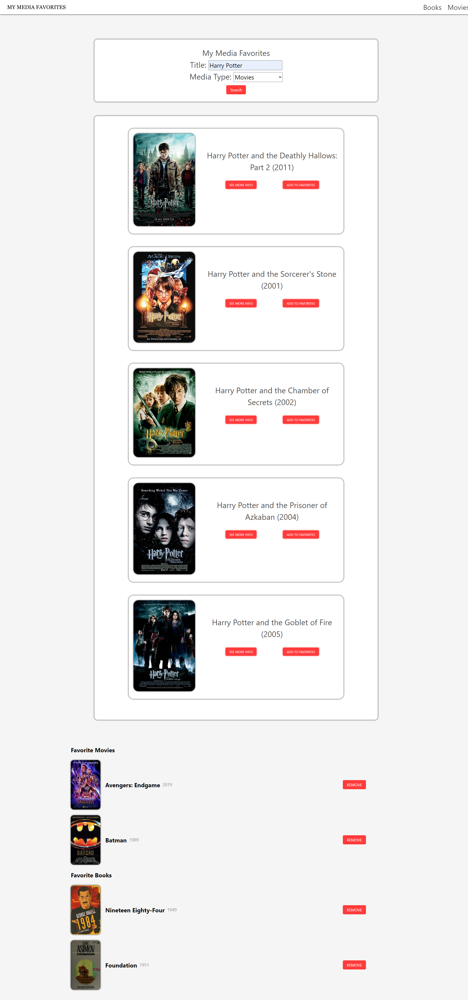

# My Media Favorites 🎥 📖

A web application designed to allow a user to pick any movie or book they choose to search for, display some general information about the searched piece of media, and then allow the user to add the media to either their favorite book or favorite movie list. This data is then saved and persisted over local storage.

## Table of Contents (Optional)

- [Installation](#installation)
- [Usage](#usage)
- [Credits](#credits)
- [License](#license)

## Installation

N/A

## Usage

The purpose of this site is to retrieve and display information on book and movie titles. This information includes the name of the director or author, the year of publication, and also the bookcover or movie poster. It utilizes the [OpenLibrary API](https://openlibrary.org/developers/api) and the [Moviebase Alternative API](https://rapidapi.com/rapidapi/api/movie-database-alternative/) which provides the book and movie data respectively.

Link to the website deployed on GitHub Pages: https://mforte215.github.io/my-media-library/

Link to the code repository on GitHub: https://github.com/mforte215/my-media-library

A screenshot of the current site:

## Credits

N/A

## License

Please refer to the LICENSE in the repo
